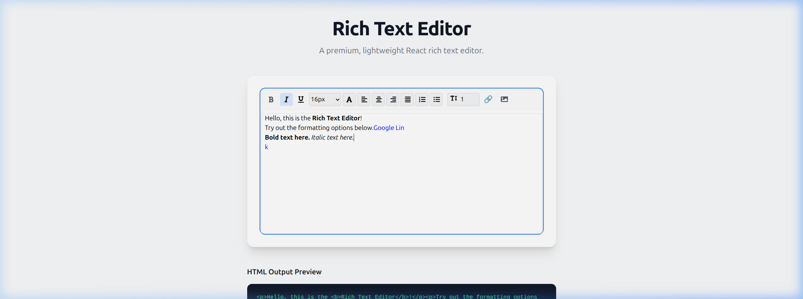

# React Lite Rich Text

A premium, lightweight, and highly customizable rich text editor for React.



## Features

-   ✨ **Premium UI**: Modern, glassmorphism-inspired design with smooth transitions.
-   📝 **Rich Formatting**: Bold, italic, underline, font sizes, colors, and line heights.
-   🔗 **Smart Links**: Automatic protocol handling (prepends `https://`) and new window navigation.
-   🖼️ **Image Support**: Easy image uploads with delete functionality.
-   🎨 **Vanilla CSS**: Premium, dependency-free styling with a modern aesthetic.
-   ⚡ **Lightweight**: Zero-dependency core (except for React and Lucide-style icons).
-   🔍 **HTML Preview**: Real-time access to the underlying HTML content.

## Installation

```bash
npm install react-lite-rich-text-editor
```

## Basic Usage

```jsx
import React, { useState } from 'react';
import { RichTextEditor } from 'react-lite-rich-text-editor';

function App() {
  const [content, setContent] = useState('');

  return (
    <div className="p-8">
      <RichTextEditor
        label="Biography"
        value={content}
        onChange={(value) => setContent(value)}
        placeholder="Tell us your story..."
      />
    </div>
  );
}
```

## Props

| Prop | Type | Default | Description |
| :--- | :--- | :--- | :--- |
| `label` | `string` | `""` | Label displayed above the editor. |
| `value` | `string` | `""` | The HTML content of the editor. |
| `onChange` | `function` | `undefined` | Callback function triggered on content change. |
| `placeholder` | `string` | `"Type here..."` | Placeholder text when empty. |
| `disabled` | `boolean` | `false` | Disables the editor and hides the toolbar. |
| `showBorder` | `boolean` | `true` | Controls the visibility of the editor's border and shadow. |
| `onImageUpload` | `function` | `undefined` | Custom handler for image uploads. |

## Development & Build

To build the project for production:

```bash
npm run build
```

The output will be generated in the `dist/` directory.

## License

MIT © [Elango](https://github.com/Elango-P)
